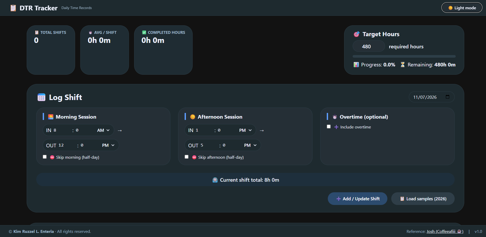
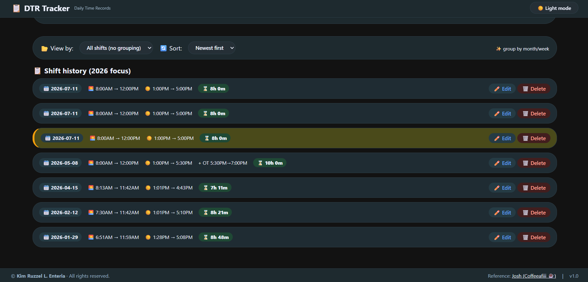
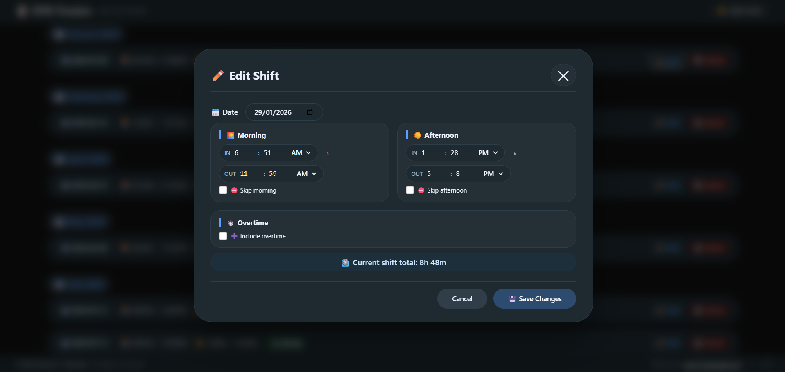

# 📋 OJT DTR Tracker – Daily Time Record Management System

**OJT DTR Tracker** is a lightweight, browser-based web application designed to simplify the recording and management of **Daily Time Records (DTR)** for students undergoing **On-the-Job Training (OJT)**, internships, or practicum programs.

Instead of manually computing rendered hours using paper logs or spreadsheets, this application automatically calculates shift durations, tracks accumulated hours, monitors progress toward the required internship hours, and provides an intuitive interface for managing attendance records.

Built using **HTML5**, **CSS3**, and **Vanilla JavaScript**, the project requires **no installation, build tools, or backend server**, making it portable and easy to use on any modern web browser.

---

# ✨ Key Features

- 📅 Record daily attendance with date selection.
- 🌅 Log **Morning Sessions** (Time In / Time Out).
- ☀️ Log **Afternoon Sessions** (Time In / Time Out).
- ⏱️ Optional **Overtime** tracking.
- 📊 Automatically calculates total rendered hours.
- 🎯 Set custom OJT target hours (default: 480 hours).
- 📈 Visual progress bar showing internship completion.
- 📋 Dashboard statistics:
  - Total Shifts
  - Average Hours per Shift
  - Completed Hours
  - Remaining Hours
- 📂 Group shift history by **Month** or **Week**.
- 🔄 Sort records from newest or oldest.
- ✏️ Edit existing entries using a modal popup.
- 🗑️ Delete unwanted shift records.
- 📋 Load sample internship data.
- 🌙 Built-in Dark Mode.
- 🔔 Toast notifications for successful actions.
- 📱 Responsive layout for desktop, tablet, and mobile devices.

---

# 📸 Screenshots

## 1. Dashboard / Landing Page



The landing page provides a complete overview of your internship progress, including statistics, target hours, progress tracking, and the Daily Time Record form. Users can immediately begin recording their attendance without additional setup.

---

## 2. Shift History & Sample Records



The application displays recorded shifts in an organized history section. Records can be grouped by month or week, sorted chronologically, and reviewed alongside automatically calculated totals and internship statistics.

---

## 3. Edit Shift



Instead of scrolling back to the form, users can modify existing attendance records through a dedicated modal editor. This streamlines corrections while preserving a clean workflow.

---

# 🎯 Purpose

The **OJT DTR Tracker** was created to simplify attendance management for students, interns, and trainees.

Rather than manually calculating rendered hours using notebooks or spreadsheets, users can maintain an organized digital attendance log that automatically computes shift durations and internship progress.

The project is suitable for:

- OJT Students
- College Interns
- Practicum Students
- Work Immersion Students
- Training Coordinators
- Academic Supervisors

---

# 🖥️ User Workflow

1. Set the required internship target hours.
2. Select the attendance date.
3. Enter morning session time.
4. Enter afternoon session time.
5. Optionally enable overtime.
6. Save the shift.
7. View automatically calculated statistics.
8. Monitor internship progress.
9. Edit or delete existing records whenever necessary.

---

# 🧰 Technologies Used

| Technology | Purpose |
|------------|---------|
| **HTML5** | Semantic page structure |
| **CSS3** | Responsive layouts, modern UI, animations, and Dark Mode |
| **JavaScript (Vanilla)** | Attendance calculations, statistics, progress tracking, modal editing, filtering, sorting, and application logic |

---

# 🚀 Getting Started

## 1. Clone the repository

```bash
git clone https://github.com/your-username/ojt-dtr-tracker.git
```

## 2. Open the project

Simply open **index.html** using any modern web browser.

No installation, package manager, framework, or local server is required.

---

## 3. Start Tracking

- Set your required internship hours.
- Add daily attendance.
- Monitor your rendered hours.
- Edit or delete entries anytime.

---

# 📂 Project Structure

```
ojt-dtr-tracker/
│
├── index.html
├── styles.css
├── script.js
│
├── img/
│   ├── main.png
│   ├── data.png
│   └── edit.png
│
└── README.md
```

---

# 📌 Recommendations – Future Improvements

To evolve the **OJT DTR Tracker** into a complete attendance management platform, consider implementing the following enhancements.

---

# 🔴 Critical (Core Functionality)

| Task | Description |
|------|-------------|
| Local Storage | Automatically save attendance records even after refreshing the browser. |
| Database Integration | Store attendance using SQLite, MySQL, PostgreSQL, or MongoDB. |
| Backend API | Build a backend using Node.js, Flask, Django, Laravel, or ASP.NET to manage records securely. |
| User Authentication | Allow students and administrators to log in and manage their own attendance. |
| Data Validation | Validate attendance entries and prevent duplicate dates or invalid time inputs. |

---

# 🟠 Important (Improves Usability)

| Task | Description |
|------|-------------|
| Export to Excel | Generate XLSX attendance reports. |
| Export to PDF | Print professional Daily Time Record forms. |
| Search Records | Quickly search attendance by date or keyword. |
| Calendar View | Visual monthly attendance calendar. |
| Attendance Analytics | Weekly and monthly attendance summaries with charts. |
| Multiple Internship Profiles | Allow users to manage multiple internship records. |
| Automatic Daily Backup | Prevent accidental data loss. |

---

# 🟢 Nice-to-have (Future Enhancements)

| Task | Description |
|------|-------------|
| Progressive Web App (PWA) | Install the application on desktop or mobile for offline use. |
| Cloud Synchronization | Sync attendance across multiple devices. |
| Mobile Application | Native Android and iOS versions. |
| QR Code Attendance | Scan QR codes for quick attendance logging. |
| Supervisor Approval | Digital signature and approval workflow. |
| Notifications | Daily reminders to record attendance. |
| Multiple Themes | Additional light, dark, and high-contrast themes. |
| Charts & Reports | Interactive visualizations of rendered hours and attendance trends. |

---

# 🛡️ Data & Maintenance

Although the current project is entirely client-side, future versions should consider:

- Secure data storage.
- Automatic backups.
- Input validation.
- Data export capabilities.
- User authentication.
- HTTPS deployment.
- Regular dependency updates.
- Error logging and diagnostics.

---

# 📄 License

This project is licensed under the **MIT License**.

You are free to use, modify, distribute, and build upon this project for personal or commercial purposes, provided that the original copyright notice and license are included.

See the **LICENSE** file for complete details.

---

# 🤝 Contributing

Contributions are always welcome.

You can contribute by:

- Reporting bugs
- Suggesting new features
- Improving documentation
- Optimizing the source code
- Submitting pull requests

For significant changes, please open an issue first to discuss the proposed improvements.

---

# 🌟 Future Vision

The long-term goal of this project is to become a complete **Internship Management System**, extending beyond attendance tracking to support:

- Student profiles
- Supervisor management
- Digital DTR approval
- Internship analytics
- Printable reports
- Cloud synchronization
- Academic dashboards
- Institution-wide deployment

---

> **OJT DTR Tracker** — *making internship attendance simple, accurate, and efficient.*

Made with ❤️ to help students manage their internship journey.

---

# 🙏 Credits & References

## 👨‍💻 Project Author

**Kim Ruzzel L. Enteria**

This project was developed as part of a personal learning initiative and portfolio to simplify Daily Time Record (DTR) management for On-the-Job Training (OJT), internship, and practicum students.

---

## 💡 Design Inspiration & Reference

The user interface and overall concept were inspired by the work of:

**Josh (Coffeeafiii ☕)**

Reference Website:
https://ojt-tracker-backup.web.app/dashboard.html

While this project takes inspiration from the original concept, the source code has been independently developed, modified, and extended with additional functionality and improvements, including:

- Internship progress tracking
- Automatic hour computation
- Configurable target hours
- Statistics dashboard
- Grouping and sorting of shifts
- Modal-based editing
- Responsive interface
- Dark mode support
- Improved user experience and maintainability

Special thanks to the original creator for sharing an inspiring project that served as a valuable learning reference.

---
